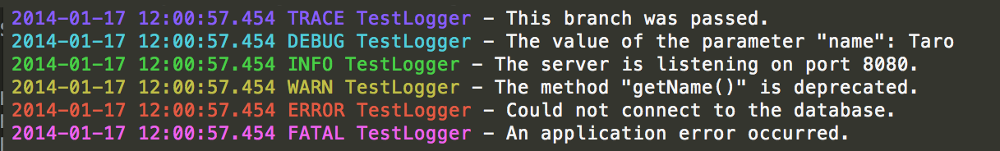

# gologger - Logger in Go

[](https://drone.io/github.com/yosssi/gologger/latest)



gologger brings a logging function to the Go language.

## Installation

	$ go get github.com/yosssi/gologger

## Examples

```Go
package main

import (
	"github.com/yosssi/gologger"
)

func main() {
	/*
		"Name" and "Level" field must be set.
		"Name" field's value will be output on the logs.
		"Level" filed can be set to the following values:
			* gologger.LevelTrace
			* gologger.LevelDebug
			* gologger.LevelInfo
			* gologger.LevelWarn
			* gologger.LevelError
			* gologger.LevelFatal
		When "File" field is not set, the logger outputs the logs to the stdout.
	*/
	logger := gologger.Logger{Name: "LoggerTest", Level: gologger.LevelTrace}
	logger.Trace("This is a logger test.")
	logger.Debug("This is a logger test.")
	logger.Info("This is a logger test.")
	logger.Warn("This is a logger test.")
	logger.Error("This is a logger test.")
	logger.Fatal("This is a logger test.")

	/*
		When "Level" field's value is set to gologger.LevelInfo, logger.Trace() and logger.Debug() don't output the logs.
		Logger output the logs when the method's degree is equal to or higher than the logger's "Level" field's degree.
		gologger.LevelTrace is the lowest degree and gologger.LevelFatal is the hightest degree.
	*/
	loggerDegree := gologger.Logger{Name: "LoggerDegreeTest", Level: gologger.LevelInfo}
	loggerDegree.Trace("This message will not be output.")
	loggerDegree.Debug("This message will not be output.")
	loggerDegree.Info("This message will be output.")
	loggerDegree.Warn("This message will be output.")
	loggerDegree.Error("This message will be output.")
	loggerDegree.Fatal("This message will be output.")

	/*
		When "File" field is set, the logger outputs the logs to the file.
	*/
	loggerFile := gologger.Logger{Name: "LoggerFileTest", Level: gologger.LevelInfo, File: "./test.log"}
	loggerFile.Info("This is a logger test. This message will be shown on the log file.")
}
```
